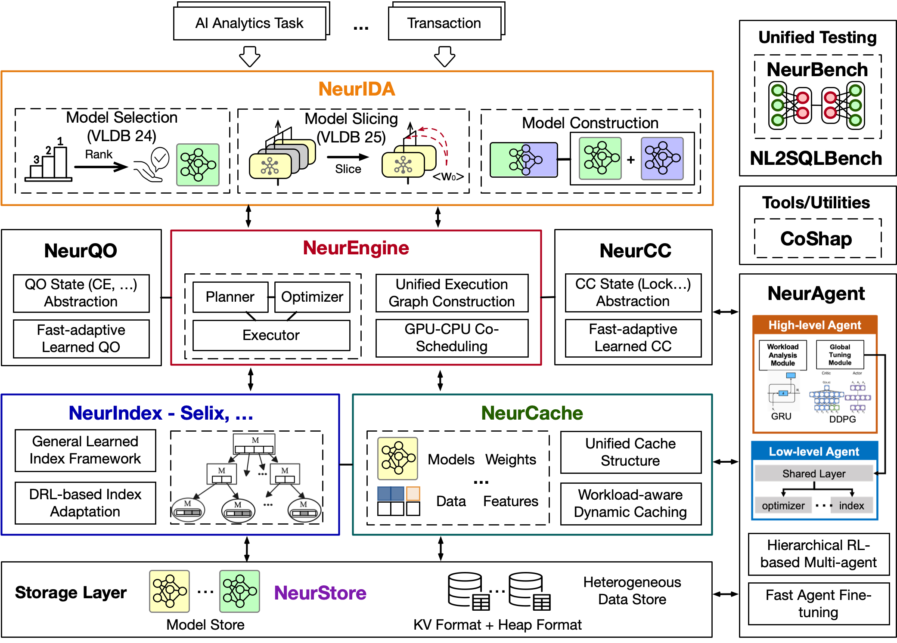

<div align="center">


[](https://neurdb.com) [](http://scis.scichina.com/en/2024/200901.pdf) [](https://vldb.org/cidrdb/papers/2025/p29-zhao.pdf) [](https://github.com/neurdb/neurdb/releases)  [](https://github.com/psf/black)

</div>

---

## Overview

**NeurDB** is a cutting-edge AI-powered autonomous database system that revolutionizes how organizations manage, query, and interact with their data. NeurDB seamlessly integrates artificial intelligence capabilities directly into the database layer, in all major components, enabling intelligent data processing and autonomous optimization.

### Why NeurDB?

Modern data systems struggle to keep up with the growing complexity of AI-driven applications. Traditional databases rely on manual tuning and external machine learning pipelines, resulting in fragmented workflows, high maintenance costs, and limited adaptability.

NeurDB redefines this paradigm by making AI a first-class citizen inside the database. It is not just a database with AI features — it is an AI-native data system that learns, adapts, and optimizes itself in real time.

Key advantages:

- **AI-Native Architecture**: AI and data processing are deeply fused within the database engine, enabling seamless model training, inference, and management.
- **Intelligent Analytics**: Built-in AI operators let users run predictive and generative analytics directly with SQL, without external pipelines.
- **Autonomous Operation**: Self-tuning, self-scaling, and self-healing mechanisms continuously optimize performance and resource usage.
- **Unified AI & Data Platform**: One system for both data management and AI lifecycle, ensuring stronger security, lower latency, and simplified workflows.


## Quick Start

### Prerequisites

- Docker and Docker Compose
<!-- - Git -->
- 8GB+ RAM recommended
- (Optional) NVIDIA GPU with CUDA support for GPU acceleration


### Installation

#### 1. Clone the Repository

```bash
git clone https://github.com/neurdb/neurdb.git
cd neurdb
chmod -R 777 .
```

#### 2. Build and Deploy

**For GPU-enabled deployment:**
```bash
bash build.sh --gpu
```

**For CPU-only deployment:**
```bash
bash build.sh --cpu
```

Wait for the system to initialize. You'll see:
```
Please use 'control + c' to exit the logging print
...
Press CTRL+C to quit
```

#### 3. Connect to NeurDB

Once running, connect to NeurDB using your preferred PostgreSQL client:

```bash
psql -h localhost -p 5432 -U postgres -d neurdb
```


## Demo

See NeurDB in action:


## Architecture

NeurDB consists of three main components:



1.	**AI Layer (NeurIDA)**: This layer manages AI models and analytics tasks inside the database and supports the lifecycle of in-database machine learning models.
    - *Model Selection (VLDB 2024)* – Automatically ranks and selects suitable models for database tasks.
    - *Model Slicing (VLDB 2025)* – Decomposes large models into smaller slices to enable efficient execution and deployment.
    - *Model Construction* – Supports the composition and integration of multiple models for AI analytics and transactional workloads.


2. **Database Engine Layer**: Built on top of an enhanced PostgreSQL engine, this layer integrates learned optimization, learned concurrency control, and runtime adaptive execution.
   - *NeurQO* – A learned query optimizer that performs fast-adaptive query optimization through query-state abstraction and workload feedback.
   - *NeurEngine* – Implements the planner, optimizer, and executor, and supports unified execution graph construction and CPU–GPU co-scheduling to execute both traditional database operators and AI operators.
   - *NeurCC (SIGMOD 2026)* – A learned concurrency control framework that models concurrency control as a learnable function and dynamically adapts to workload changes.

3.	**Adaptive Data Access Components**: NeurDB incorporates adaptive data access modules that improve indexing and caching performance under dynamic workloads.
	- *NeurIndex* – A general learned index framework for adaptive index design and optimization under dynamic workloads, with *Selix (SIGMOD 2026)* as one implementation that enables DRL-based index adaptation.
	- *NeurCache* – A workload-aware caching framework that jointly manages model weights, features, and data through a unified cache structure.

4. **Storage Layer**: A dual-format storage system supporting both key–value (RocksDB), heap storage, and model storage (*NeurStore*).
   - *NeurStore* – Provides efficient storage and management for deep learning models.

5. **Benchmarking and Evaluation**
NeurDB also includes benchmarking frameworks for evaluating AI-powered database systems and learned components.

   - *NeurBench (SIGMOD 2026)* – A unified benchmark for evaluating learned database components under data and workload drift.
   - *NL2SQLBench (VLDB 2026)* – A modular benchmark for evaluating LLM-enabled NL2SQL systems.

1. **Tools and Utilities**
NeurDB provides additional system tools to support model interpretation and system analysis.

   - *CoShap* – A scalable method for Shapley value approximation to support model interpretation and feature contribution analysis.

<!-- ### Development Setup

For contributors looking to develop NeurDB:

- [DBEngine Development Guide](./doc/db_dev.md)
- [AIEngine Development Guide](./doc/ai_dev.md) -->


## Publications

NeurDB is backed by rigorous academic research. Our work has been published in top-tier venues:

### Papers

1. **NeurDB: An AI-powered Autonomous Data System** [[PDF]](http://scis.scichina.com/en/2024/200901.pdf)
   *SCIENCE CHINA Information Sciences, 2024*

2. **NeurDB: On the Design and Implementation of an AI-powered Autonomous Database** [[PDF]](https://vldb.org/cidrdb/papers/2025/p29-zhao.pdf)
   *CIDR 2025*

3. **Database Native Model Selection: Harnessing Deep Neural Networks in Database Systems** [[PDF]](https://www.vldb.org/pvldb/vol17/p1020-xing.pdf)
   *VLDB 2024*

4. **Powering In-Database Dynamic Model Slicing for Structured Data Analytics** [[PDF]](https://www.vldb.org/pvldb/vol17/p4813-zeng.pdf)
   *VLDB, 2025*

5.  **NeurStore: Efficient In-database Deep Learning Model Management System**
   *SIGMOD 2026*

6. **Modeling Concurrency Control as a Learnable Function**
   *SIGMOD 2026*

7. **On Self-Designing Learned Indexes**
   *SIGMOD 2026*

8. **NL2SQLBench: A Modular Benchmarking Framework for LLM-Enabled NL2SQL Solutions**
   *VLDB 2026*

9.  **NeurBench: A Benchmark Suite for Learned Database Components with Drift Modeling**
   *SIGMOD 2026*

10. **CoShap: A Scalable Coalition Growth Approach to Shapley Value Approximation**
   *SIGMOD 2026*


### Citation

If you use NeurDB in your research, please cite:

```bibtex
@article{neurdb-scis-24,
  author  = {Beng Chin Ooi and Shaofeng Cai and Gang Chen and
             Yanyan Shen and Kian-Lee Tan and Yuncheng Wu and
             Xiaokui Xiao and Naili Xing and Cong Yue and
             Lingze Zeng and Meihui Zhang and Zhanhao Zhao},
  title   = {NeurDB: An AI-powered Autonomous Data System},
  journal = {SCIENCE CHINA Information Sciences},
  year    = {2024},
  url     = {https://www.sciengine.com/SCIS/doi/10.1007/s11432-024-4125-9},
  doi     = {10.1007/s11432-024-4125-9}
}
```
</div>
